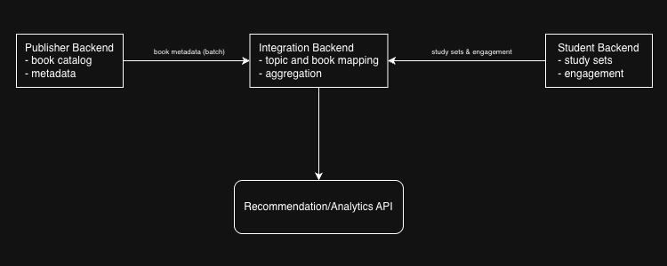

# Essay 1 — System Design

## 1. High-Level Architecture
The system consists of three main components:

- Publisher Backend: manages book catalog and publisher metadata.
- Student Backend: manages study sets and student engagement.
- Integration Backend: connects data between both products.

Publisher Backend sends book metadata to the Integration Backend.
Student Backend sends study set data and engagement events to the Integration Backend.

The Integration Backend maintains canonical subjects and topic to book mappings, which are used to support book recommendations for students and aggregated analytics for publishers.

Both products remain loosely coupled and do not communicate directly.

## 2. Simple architecture

## 3. Canonical Data Model
The Integration Backend maintains a canonical data model to connect publisher books and student study topics.

### Book catalog + publisher metadata
- Publisher(publisher_id, name)
- Book(book_id, publisher_id, title, description, tags)

### Subject/grade taxonomy + category/subcategory
- Subject(subject_id, name)
- Grade(grade_id, name)
- Category(category_id, name, parent_category_id)

These form a simple taxonomy (subject -> category -> subcategory) to normalise topics.

### Study sets + engagement events
- StudySet(study_set_id, user_id, subject_id, grade_id, title, created_at)
- EngagementEvent(event_id, study_set_id, event_type, occurred_at)

### Relationships between study topics and books
- Topic(topic_id, label, subject_id, grade_id)
- TopicBookMapping(topic_id, book_id, weight)

TopicBookMapping represents the many to many relationship between topics and books and is used for recommendation ranking.

## 4. Sync Strategy
Publisher Backend periodically syncs book catalog updates to the Integration Backend via API (scheduled batch).  
Student Backend sends study set creation and engagement events to the Integration Backend via API in near real-time.

### Batch + near real-time (hybrid)
- Book catalog is synced in batches (hourly/daily) because changes are infrequent and payloads can be large.
- Student engagement is sent near real-time because it directly affects recommendations.

### API batching
Large datasets are split into smaller batches (e.g., 500-10,000 records per request).  
Each batch is sent independently over HTTP.

If one batch fails, it is logged and retried without stopping the entire sync process.

### Payload optimisation
Payloads are gzip-compressed to reduce bandwidth and speed up transfers.

### Idempotency & deduplication
- Catalog sync uses upsert (same book_id updates existing records).
- Engagement events use unique event_id to prevent duplicates.

This allows safe retries without corrupting data.

### Ordering
Engagement events are processed using occurred_at timestamps.  
Late events can still be handled through time-based aggregation.

## 5. Recommendation Approach
Book recommendations are generated by mapping student study topics to books using TopicBookMapping.

Each topic–book relationship has a weight that represents how relevant a book is to a specific topic.

The final ranking score of a book is calculated using:

- Topic relevance weight
- Student engagement frequency (e.g., views, completions)
- Recency of engagement

Example scoring formula:

score = weight × log(engagement_count + 1) x recency_factor

### Explanation
- weight comes from TopicBookMapping and represents how strongly a book matches a topic.
- engagement_count measures how often students interact with that topic or book.
- log scaling prevents very popular topics from dominating the ranking.
- recency_factor gives slightly higher weight to recent activity.

Books with higher scores are ranked higher in recommendations.

Only aggregated engagement data is used to preserve student privacy.

## 6. Scalability & Reliability
- Integration Backend is horizontally scalable behind a load balancer.
- Batch-based sync allows processing large datasets without overwhelming the system.
- Database indexes on topic_id, book_id, and occurred_at improve query performance.
- API calls use retry with backoff to handle transient failures.
- Idempotent ingestion ensures retries do not create duplicate records.
- Failed batches can be logged and sent to a dead-letter queue for later reprocessing.
- Background workers are used for heavy aggregation and recommendation updates.

## 7. Observability & Data Quality
- Structured logging is added for each sync job and batch (batch size, duration, success/failure).
- Metrics are collected for ingestion latency, batch throughput, error rate, and recommendation refresh time.
- Distributed tracing is used to track requests across Publisher Backend, Integration Backend, and Student Backend.
- Alerts are configured for abnormal failure rates or delayed syncs.
- Input data is validated at ingestion time (schema checks, required fields).
- Periodic reconciliation jobs detect missing mappings or inconsistent aggregates.